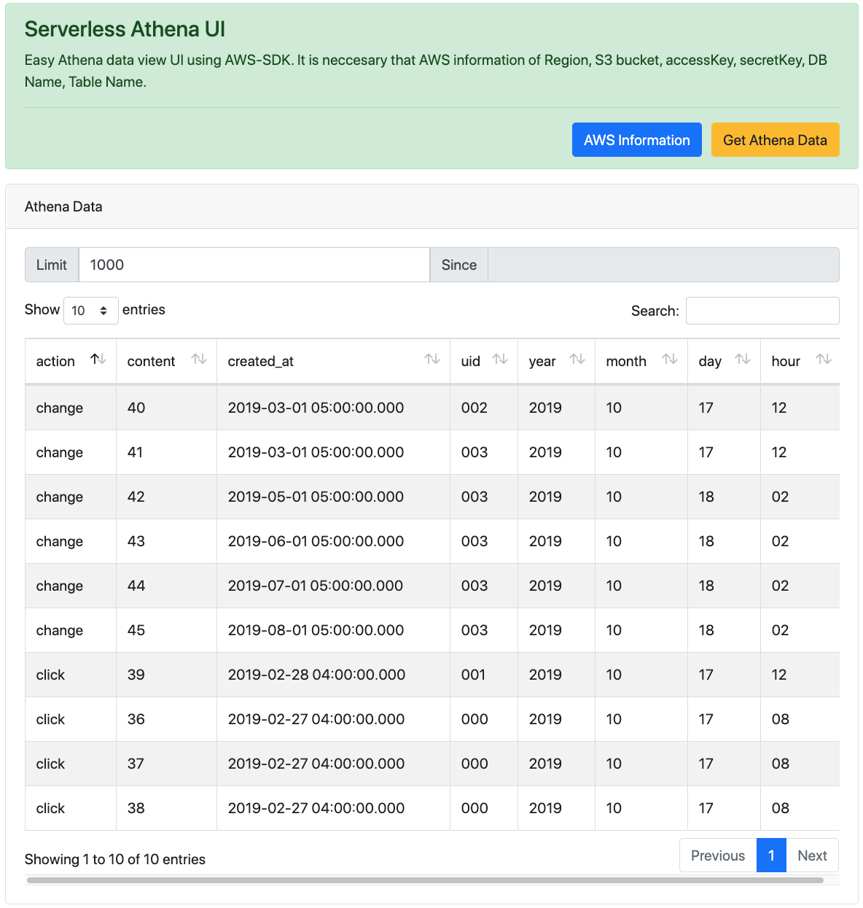

# serverless-aws-athena-ui

**Serverless AWS Athena UI - Simple & Easy query view of AWS Athena.**



## Usage Steps

1. Fill information into `config.js` and save it.
``` javascript
const config = {
    accessKeyId: "XXXXXXXXXXXXXXXXXXXXXX",
    secretAccessKey: "xxxxxxxxxxxxxxxxxxxxxxxxxxxxxxxxxxxxxxx",
    region: "us-east-1",
    s3_bucket: "s3://xxxxxxxxxxxxxxxxxxxx",
    db_name: "xxxxxxxxxxxxxxxxxx",
    table_name: "xxxxxxxxxxxxxxxxxxx"
}
```

2. Open `athena_ui.html` and click `Get Athena Data` button.

## Include

- AWS-sdk
- Bootstrap4
- Datatables
